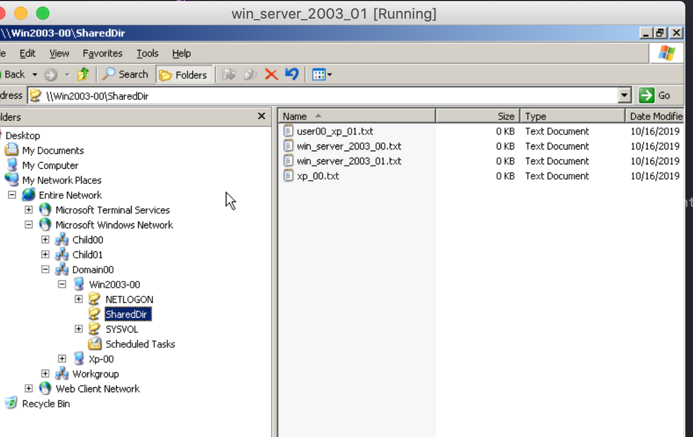

# Active Directory Domain Services (AD DS)

## Theory

[1] Active Directory Domain Services are the foundation for distributed networks built on Windows 2000 Server, Windows Server 2003 and Microsoft Windows Server 2008 operating systems that use domain controllers. Active Directory Domain Services provide secure, structured, hierarchical data storage for objects in a network such as users, computers, printers, and services. Active Directory Domain Services provide support for locating and working with these objects.

[2] The structure of the hierarchy includes an AD forest, the forest's domains and organizational units in those domains. AD DS integrates security by authenticating logons and controlling who has access to directory resources.

General schema

 
 

Windows 2003 servers

 
 

Windows xp clients

 
 

## Tasks
1. Install 3 Windows 2003 servers + 3 Windows XP as Virtual machines
2. Configure the first windows server to be the DNS forest root
3. Configure the other 2 windows server to be children of this forest
4. For each of these windows servers, connect a client XP windows
5. Configure a shared folder
6. Configure a shared printer

## Step by step
### Task 1
**Install 3 Windows 2003 servers + 3 Windows XP as Virtual machines**

1. Install win 2003 server, then clone it 2 times
2. Install win xp, then clone it 2 times

### Task 2
**Configure the first windows server to be the DNS forest root**

1. On **win_server_2003_00** run `dcpromo` command in cmd
2. Install everything by default and don't forget the passwords

I've set my domain to be `domain00.com`

### Task 3
**Configure the other 2 windows server to be children of this forest**

1. Also install with `dcpromo` but instead, use the second option somewhere: **Child domain in an existing domain tree**
2. For credentials, use the Administrator (the one u log in with in the win_server_2003_00). For the domain, use whatever ur root domain is called, mine is `domain00.com`
3. Start crying because it can't find the entered domain.

**Why it doesn't work?**
Idk to be honest, but the main idea is that u gotta be able to ping the other computers.
What I did:
1. Stop crying
2. Configure the virtual boxes to be in the same local network:
 2.1 Shut down the VMs
 2.2 In the VM's settings -> Network. Set the first adapter to be attached to **Internal Network** and name: `intnet-active-dir`. This name must be the same for all machines
 
3. Inside windows, search for `Network Connections`
 
4. Right click on that Local Area Connection -> Properties -> Internet Protocol (TCP/IP)
5. Use the following IP Address:
  1. IP Address: 192.168.2.42
  2. Mask: 255.255.255.0
  3. Default gateway: 192.168.2.1
  4. Preferred DNS server: 192.168.2.42
  Set this on all the machines, but change the IP address, mines are:
  192.168.2.42 - root
  192.168.2.43 - child1
  192.168.2.44 - child2
6. Try to ping each other
7. Try to ping the domain
8. Start task 3 again

*Task 3 continuation*

4. It should be able to find the domain
5. I've set the child domains to be: `child00` and `child01`
6. Start crying because u get an error stating that a name or smth is already taken.
 1. The computer names are probably the same - change them
7. Now it should work

**How do I know that it works?**
The computer's full name must be something like this:
~~~
win2003-00.domain00.com
win2003-01.child00.domain00.com
win2003-02.child01.domain00.com
~~~

Or, In `Start -> Administrative Tools -> Active Directory Domain and Trusts` u should see doman00 and domain00 -> child00.domain00.com

### Task 4
**For each of these windows servers, connect a client XP windows**

1. Make sure they are in the same network (as described above)
2. Change the IP stuff with the same idea as above
3. Make sure you can ping `domain00.com`, `child00.domain00.com` and `child01.domain00.com`
4. My Computer -> Properties or smth -> Computer Name -> To rename this computer ... *Change*
5. Write in the domain
6. Similar to the other XP computers
7. Done

**For the child servers**
`child00.domain00.com` and `child01.domain00.com`
Make sure you can ping the child servers as well.

**Side note**
It's very weird, but make sure all the VMs are not sleeping (not afk) (I've spent a whole 2 hours just on this stupidity)

**How to check that it works**
The full computer name should tell

### Task 5
**Configure a shared folder**

1. In win_server_2003_00 create `C:\SharedDir`
2. Right click -> properties -> sharing -> enable sharing
3. Start -> Administrative Tools -> Computer Management
4. Computer Management -> System Tools -> Shared Folders -> Shares

5. You should see your SharedDir
6. Right click on SharedDir -> Properties -> Publish -> Check Publish this share...

**To access the shared dir**
From any machine:

Start -> Windows Explorer or smth -> **My Network Places** -> ... -> Microsoft Windows Network -> Domain00 -> Win2003_00 -> SharedDir

It's also possible to tweak the permissions to allow only a specified user.

### Task 6
**Configure a shared printer**

1. In win_server_2003_00: Start -> Printers and Faxes -> Add printer - everything by default except this:

2. From any other computer, log in as User defined by domain00. For this you probably will need to create a User:
  1. win_server_2003_00: Start -> Administrative Tools -> Active Directory Users and Computers
  2. Users -> Create a new user
3. Create a file an try to print it -> Find printer or something
4. On win_server_2003_00: Start -> Printers and Faxes -> Open your printer

## Conclusion
I was very curious abut how the sysadmins at my job manage multiple printers and users from a centralized place. This laboratory work gave me an insight about how they may be doing their job.

### References
[1] - https://docs.microsoft.com/en-us/windows/win32/ad/active-directory-domain-services

[2] - https://searchwindowsserver.techtarget.com/definition/Microsoft-Active-Directory-Domain-Services-AD-DS
