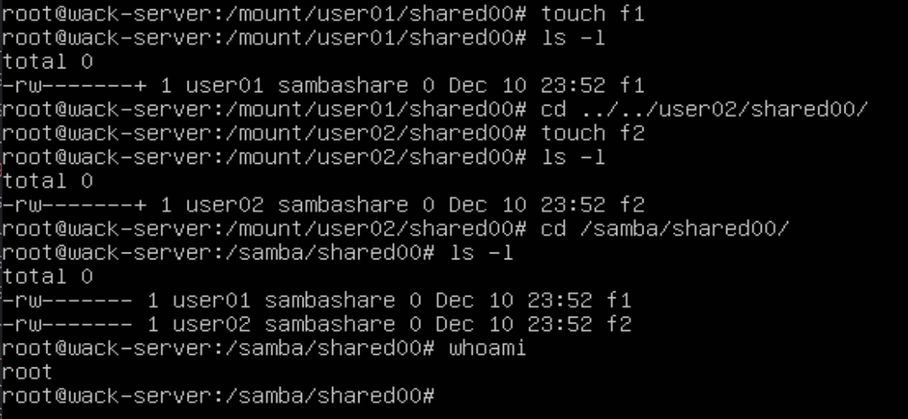
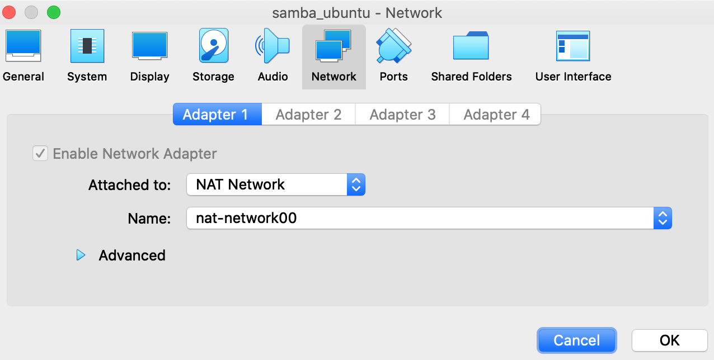
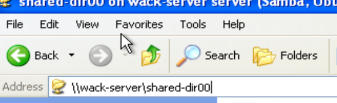
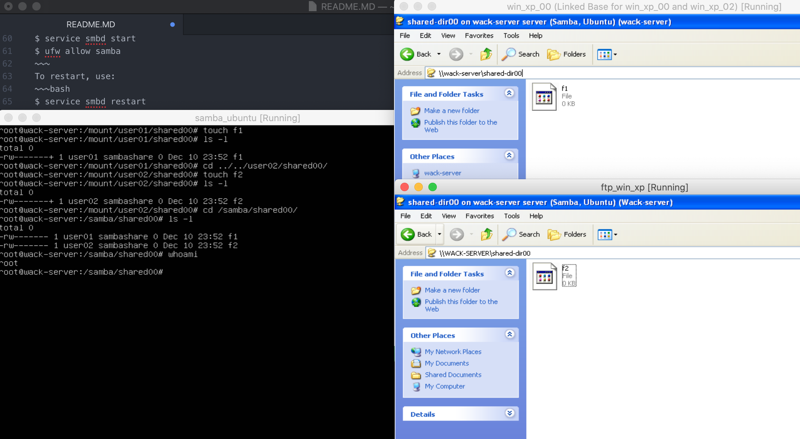

# Samba 💃

## Tasks
Install and configure Samba server on Linux machine. Make it so that, 2 users should not be able to see/browse other users’ directories/files despite them both browsing one directory. Test it from another 2 machines running Windows.

## Implementation

1. Install Ubuntu

2. In ubuntu, install samba
~~~bash
apt update
apt install samba
~~~

3. Open `/etc/samba/smb.conf`

4. Below `[global]`, add this (if you're gonna use Windows XP):
~~~
server max protocol = NT1
lanman auth = yes
ntlm auth = yes
~~~

5. At the end add these:
~~~
[shared-dir00]
    path = /samba/shared00
    hide unreadable = yes
    create mask = 0700
    directory mask = 0700
    browseable = yes
    read only = no
    guest ok = no
~~~

6. Create 2 users. Add them to the `smbpasswd` file and to the `sambashare` group:
~~~bash
adduser user01
adduser user02

smbpasswd -a user01
smbpasswd -a user02

usermod -a -G sambashare user01
usermod -a -G sambashare user02
~~~

7. Create dir `/samba/shared00`. Transfer the ownership to the group `sambashare`. Set the permission to 3770.
~~~bash
mkdir -p /samba/shared00
chown :sambashare /samba/shared00
chmod 3770 /samba/shared00
~~~

8. Now start the Samba server and add firewall rule to allow Samba traffic:
~~~bash
service smbd start
ufw allow samba
~~~

To restart:
~~~bash
service smbd restart
~~~

## To check if it works

### From the same ubuntu machine
1. Install `cifs-utils` or something
2. U gotta mount the shared dir from user01 and user02
~~~bash
mount -t cifs -o user=user01 -o vers=1.0 //wack-server/coolshare /mount/user01/shared00
~~~

`wack-server` - is my computer name. `localhost` should work too

`/mount/user01/shared00` don't forget to create these dirs first.

**What to expect?**
As root, creating files in `/mount/user01/shared00` should result in creating files as user01.

As root, files created by user02 should not be seen in `/mount/user01/shared00`

All files, both from user01 and user02 should be visible in `/samba/shared00`

### From windows
1. Ubuntu and Windows must be on the same NAT Network:

2. To access the shared dir:

## Final result

