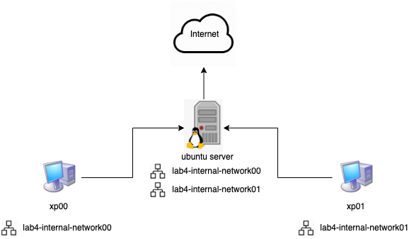
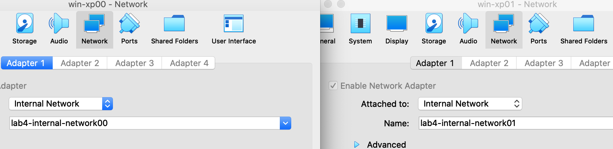
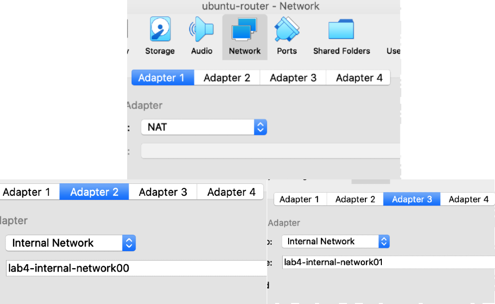
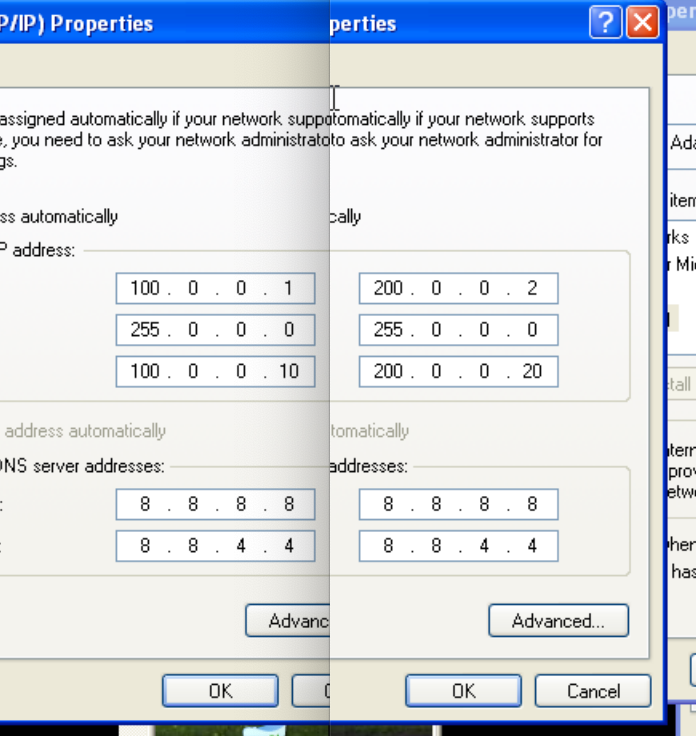
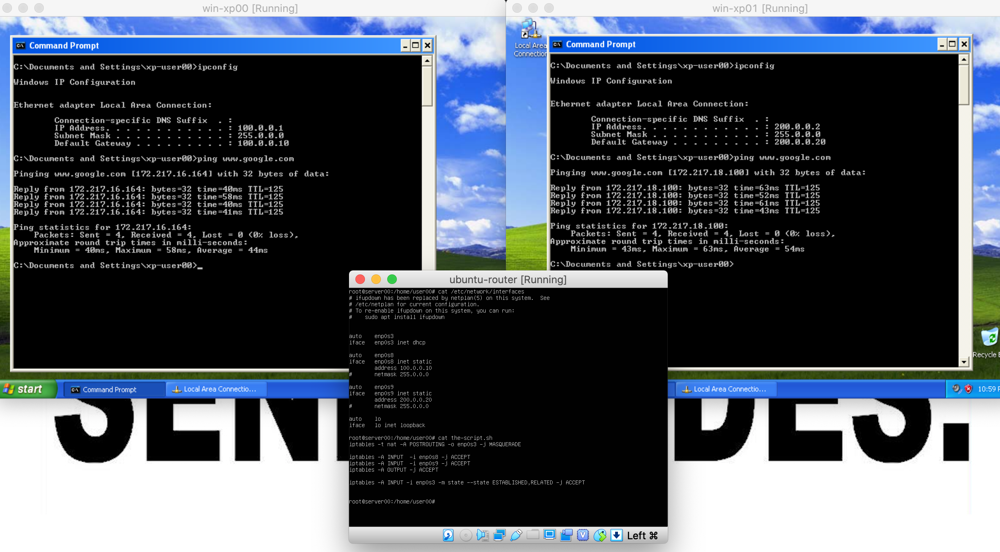

# Homemade router

## Task
Configure a Linux machine to be the router of 2 Windows machines.

### Theory

#### Iptables
`iptables` - administration tool for IPv4 packet filtering and NAT,

Iptables is used to set up, maintain, and inspect the tables of IP packet filter rules in the Linux kernel. Several different tables may be defined. Each table contains a number of built-in chains and may also contain user-defined chains.

Each chain is a list of rules which can match a set of packets. Each rule specifies what to do with a packet that matches. This is called a 'target', which may be a jump to a user-defined chain in the same table.

#### Network interface
A network interface is a software interface to networking hardware. Linux kernel distinguishes between two types of network interfaces: physical and virtual.

* Physical network interface represents an actual network hardware device such as network interface controller (NIC). In practice, you’ll often find eth0 interface, which represents Ethernet network card.

* Virtual network interface doesn’t represent any hardware device and is usually linked to one. There are different kinds of virtual interfaces: Loopback, bridges, VLANs, tunnel interfaces and so on. With proliferation of software defined networks, virtual interfaces become wildly used.

### Setup

  

  1. Setup 2 Windows machines with the following network configurations:

  

  Each XP is in its own internal network. They should have no access to the internet.

  **Disable the Firewall.**

2. Setup a Ubuntu server with the following network configurations:

  

  `NAT` - just to have access to the internet

### Implementation

  1. Configuring IPv4 settings on both xps

  

  For the DNS server, we choose the [Google Public DNS](https://en.wikipedia.org/wiki/Google_Public_DNS)

  2. Configuring the network interfaces on the Linux machine.

  Running `ifconfig` you will see the `enp0s3` network interface. It may differ.

  In the file `/etc/network/interfaces` add:
  ~~~
  iface enp0s8 inet static
    address 100.0.0.10

  iface enp0s9 inet static
    address 200.0.0.20
  ~~~

  3. To apply the changes, reboot - just to be safe

    Or run `/etc/init.d/networking restart`

  4. Create & run a script with the following iptable rules:
  ~~~bash
  iptables -t nat -A POSTROUTING -o enp0s3 -j MASQUERADE

  iptables -A INPUT  -i enp0s8 -j ACCEPT
  iptables -A INPUT  -i enp0s9 -j ACCEPT
  iptables -A INPUT  -i enp0s3 -m state --state ESTABLISHED,RELATED -j ACCEPT

  iptables -A OUTPUT -j ACCEPT
  ~~~

  These rules enable masquerading on enp0s3 and enable datagrams to the 2 interfaces.

  Masquerading - is an algorithm dependent on the iptables implementation that allows one to route traffic without disrupting the original traffic.

  5. Enable `ipv4` forwarding:

  In `/etc/sysctl.conf`, uncomment `net.ipv4.ip_forward = 1`

### Final Result

Both XP machines should be able to ping `www.google.com` and each other, like they are in the same network.

## Conclusion

In this laboratory work I learned about iptables, network interfaces and what tricks can be done with these.
