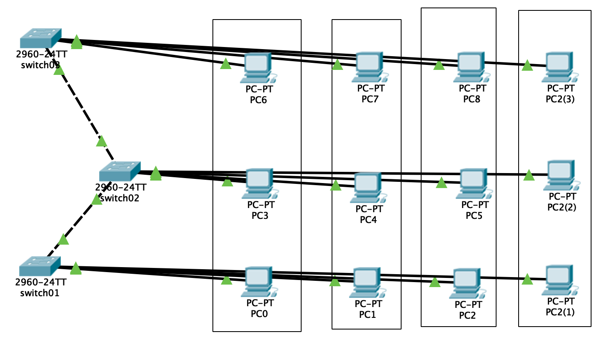

# Virtual LANs (VLANs)

## Tasks
Create a network in Cisco Packet Tracer. This network should contain three switches interconnected with each other. To each of the switches three endpoints should be connected. Configure three separate VLANs on all switches.

## Theory
VLANs allow you to configure the virtual local area network. With VLAN you can make machines connected to one switch appear to be on different LANs.

## Implementation

### The Cisco Packet Tracer thing

Drag and drop the network like shown on figure 1. First three ports on each switch are used by endpoints and last 1 or 2 ports are used to connect to other switches. The fourth VLAN was additional required as an additional task.

**Don't bother with the cables yet.**

### Configure the IPs on the computers

~~~
1.1.101.1 - PC1 VLAN 101
1.1.101.2 - PC2 VLAN 101
1.1.101.3 - PC3 VLAN 101

1.1.102.1 - PC1 VLAN 102
1.1.102.2 - PC2 VLAN 102
1.1.102.3 - PC3 VLAN 102

1.1.103.1 - PC1 VLAN 103
1.1.103.2 - PC2 VLAN 103
1.1.103.3 - PC3 VLAN 103

The mask: 255.255.255.0 - should be the same or smth.
~~~

### The config
Open the CLI on each switch and type the following (the same configs for each switch):
~~~bash
# Part 1
en
conf t
vlan 101
name vlan101
exit

vlan 102
name vlan102
exit

vlan 103
name vlan103
exit

# Part 2
int fa0/1
switchport access vlan 101
no shutdown
exit

int fa0/2
switchport access vlan 102
no shutdown
exit

int fa0/3
switchport access vlan 103
no shutdown
exit

# Part 3
int fa0/10
switchport mode trunk
switchport trunk allowed vlan 101,102,103
no shutdown
exit
~~~

And on the middle switch (the one that has 2 cables), add the additional configs:

~~~
int fa0/11
switchport mode trunk
switchport trunk allowed vlan 101,102,103
no shutdown
exit
~~~

#### What is happening here?
 1. First, we create the vlans and give them some names.
 2. Then we configure the interfaces. `fa0/1` for example is an actual ethernet socket on the switch. So, we configure interfaces to allow only a specific VLAN. So, on `fa0/1` we will only allow VLAN101, so, we will connect the computer we want to be in VLAN101 to the `fa0/1` interface on the switch (cable).
 3. Then, we must connect the switches between them. We use `trunk`. I didn't understand this.

## Final result
The computers in the same VLAN should be able to ping each other. It should not be able to ping PCs from other VLANs.

# Additional task
He asked to implement STP in case a cable is unplugged. I haven't done this.

# Conclusion
I learned about VLANs and how to configure them. I have also looked into STP and what it's beast to eat this with.
